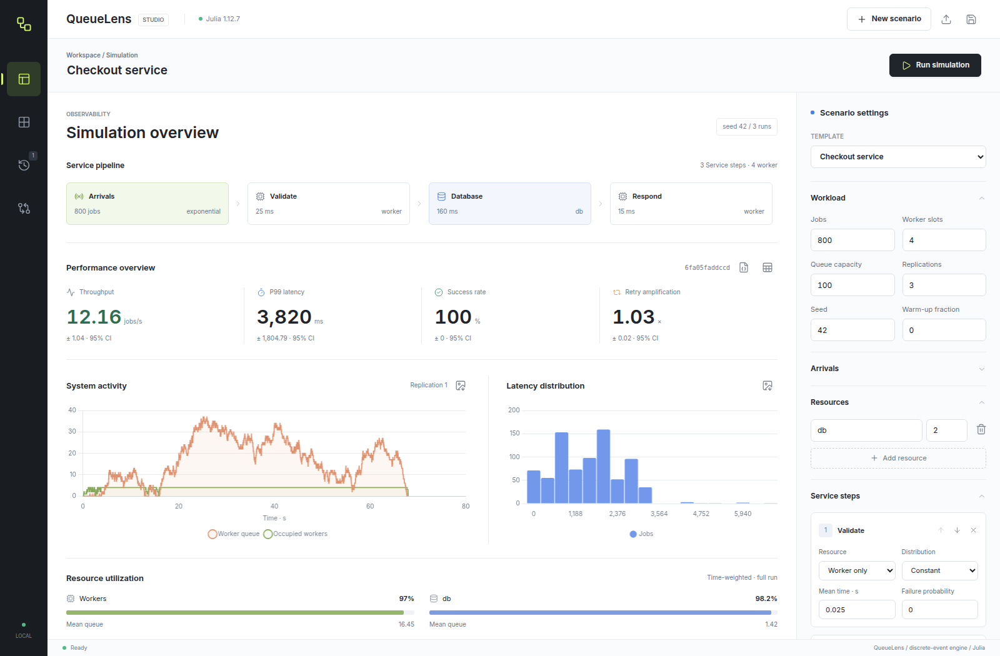
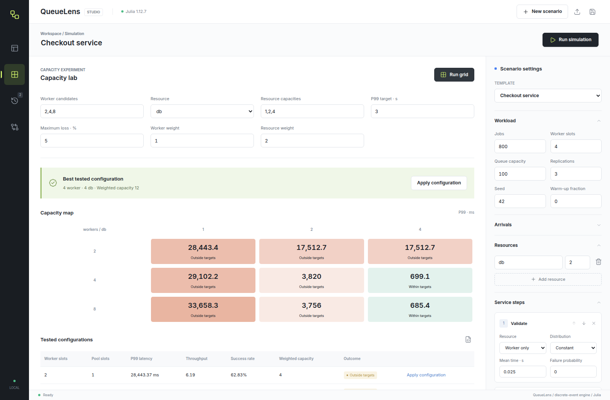
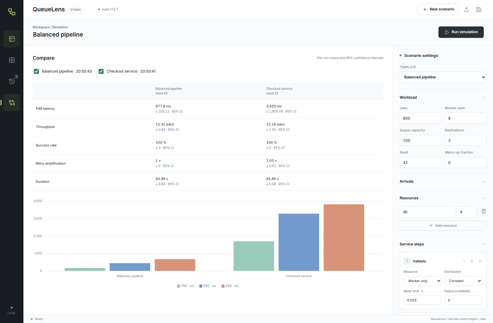

# QueueLens Studio

A Julia discrete-event simulator with a local graphical workspace for designing
service pipelines and measuring queues, latency, resource contention and retries.
Milestone 5 is a browser UI backed by Julia, not a command-line application.

## Screenshots

The workspace below shows actual simulation output: an editable service
pipeline, latency and queue charts, and worker/resource utilization.



<details>
<summary>Capacity experiments and run comparison</summary>

### Capacity Lab

Compare worker and resource capacities against latency and loss targets.



### Run Comparison

Compare saved reports using per-run metrics and confidence intervals.



</details>

## Start the Studio

Requires Julia 1.10 or newer; verified locally with Julia 1.12.7.

```sh
julia --project=. -e 'using Pkg; Pkg.instantiate()'
julia --project=. app/server.jl
```

Open **http://127.0.0.1:8787**. The first startup can take longer while Julia
compiles. Choose another port with
`QUEUELENS_PORT=8788 julia --project=. app/server.jl`.
Stop the server with Ctrl+C. Assets are bundled locally; Node and an internet
connection are not needed to run the UI after Julia dependencies are installed.

The interface is English-only, with a compact navigation rail, a dedicated
scenario inspector and a responsive analytics workspace. It includes:

- An editable workload, sequential stages, named resource pools and bounded queues.
- Constant, exponential, log-normal and burst arrivals; per-stage timing and faults.
- Per-attempt timeouts; fixed, capped exponential and full-jitter retry policies.
- Replicated runs, confidence intervals, queue traces and latency histograms.
- Searchable job outcomes and individual attempt histories.
- Capacity sweeps, a heatmap and a lowest-cost feasible tested configuration.
- Local run history, three-way comparisons, JSON/TOML configuration import/export,
  JSON reports, CSV job outcomes and PNG charts.
- Progress, cancellation and validation with bounded workloads.

History is stored in this browser's IndexedDB, retaining the latest 12 reports.
The editable draft is separate from saved reports. Export reports before clearing
browser storage. The server is local-only, without accounts or cloud storage.

## Modeling Contract

All configuration durations are **seconds**. UI latency charts use milliseconds.
The clock advances in virtual time; service durations never cause real sleeping.

- Workers are total concurrent slots, not OS threads or a nested per-worker pool.
- Every job follows its ordered stages. A stage acquires zero or one named pool
  slot and releases it when the stage ends. Workers remain occupied while waiting
  for a resource. Multiple simultaneous resource acquisition is not modeled.
- Worker and resource waiting are FIFO. Worker queue capacity excludes active jobs;
  zero means immediate rejection when all workers are occupied.
- Timeout starts when each attempt obtains a worker. It includes resource waits,
  but excludes waiting for a worker and retry backoff. Completion exactly at its
  deadline wins.
- Failure probability is evaluated independently when each stage starts, on every
  attempt. A sampled failure occurs halfway through that stage's duration.
- A retry restarts the whole job at step one, retaining its sampled stage durations.
  Backoff holds no worker or resource. Retried work reenters bounded admission;
  refusal produces terminal failure reason `:retry_queue_full`.
- `max_attempts` includes the original attempt. Older-attempt events cannot modify
  later attempts or extend the observation window.
- One logical job has one terminal outcome. Attempt records are separate.

The model does not execute arbitrary user code from imported configurations,
run actual services, or simulate branching workflows and distributed systems.

## Reports and Recommendations

The main metrics average per-run values across consecutive seeds. Confidence
intervals measure variation across those runs, not a guarantee about rare tails.
One replication provides no interval and no capacity recommendation.

Latency percentiles use the nearest-rank definition and successful jobs only.
Warm-up removes an initial fraction of completions from latency/waiting estimates.
Initial waiting means the first worker wait, not total retry or resource waiting.
Studio throughput is completions divided by the entire virtual run duration.
Monitoring integrates occupancy and queue lengths over that same full window.
Zero-duration throughput and unavailable latency are shown as unavailable, not zero.

Charts, job rows and attempt histories describe the first replication. Traces
are downsampled for display; time-weighted integrals remain exact. JSON reports
include all replication summaries, normalized configuration, seeds, versions,
UTC timestamp and a configuration fingerprint.

The capacity lab varies worker slots and one selected pool while keeping the
same workload seeds. A candidate is feasible when the upper 95% confidence bounds
for mean per-run P99 and loss meet the chosen targets. Among feasible tested
candidates, it minimizes worker and pool capacity weighted by the supplied costs.
This is a finite-grid comparison, not an optimizer over untested capacities or a
production SLO guarantee. Zero observed losses do not establish zero true risk.

## Julia API

```julia
using QueueLens

jobs = [
    Job(1, 0.0, [ServiceStep(:db, 0.3; failure_probability=0.1)]; timeout=1.0),
    Job(2, 0.1, [ServiceStep(:db, 0.2)]; timeout=1.0),
]
result = simulate(jobs, Dict(:db => 1), 2;
    retry_policy=RetryPolicy(max_attempts=3, backoff=FullJitterBackoff(0.1; cap=2.0)),
    seed=42, trace=true)
result.completed
result.failed
result.attempts

config = default_configuration()
config["jobs"] = 200
report = run_experiment(config)
sweep = run_sweep(config, Dict(
    "workers" => [2, 4, 8], "resource" => "db", "capacities" => [1, 2, 4],
    "p99_target" => 2.0, "max_loss" => 0.05))
```

Resource capacities are always explicit; use `Dict{Symbol,Int}()` for none.
Custom Julia backoff functions implement `backoff(rng, attempt_id)` and return a
finite nonnegative delay. Configuration files expose only the built-in policies.
The older `summarize` API retains its first-retained-arrival throughput window;
Studio's full-run throughput is deliberately separate.

## Verification

```sh
julia --project=. -e 'using Pkg; Pkg.test()'
# With the Studio server running:
npm ci --prefix app
cd app
npx playwright install chromium
npm test
```

Browser tests cover real simulations, editing, exports, history, comparison,
capacity sweeps, mobile layout and HTTP boundaries. Set `QUEUELENS_URL` for a
non-default server URL or `QUEUELENS_CHROMIUM` for an existing Chromium binary.
After updating frontend dependencies, `npm run vendor --prefix app` refreshes
the bundled assets and licenses; `npm run format --prefix app` formats UI sources.
With the server running and Playwright installed, `npm run screenshots --prefix app`
regenerates the README images in an isolated browser profile.

## Layout and Status

| Milestone | Delivered scope |
|---|---|
| 0-2 | Deterministic engine, distributions, seeded statistics |
| 3 | Worker slots, shared resource pools, bounded admission and monitoring |
| 4 | Failure, timeout, attempt isolation, callable backoff and retry execution |
| 5 | Julia-backed graphical workspace, configurations, reports and charts |
| 6 | Replicated capacity sweeps and evidence-based capacity selection |

See [PROGRESS.md](PROGRESS.md), [architecture](docs/architecture.md) and
[configuration reference](docs/configuration.md). The original learning journey
is preserved in [the archived log](docs/learning-log.md).

This remains a local research/learning tool, not production queue infrastructure.
Third-party asset licenses are bundled in `app/public/vendor/`.
The project's own license has not yet been selected.
