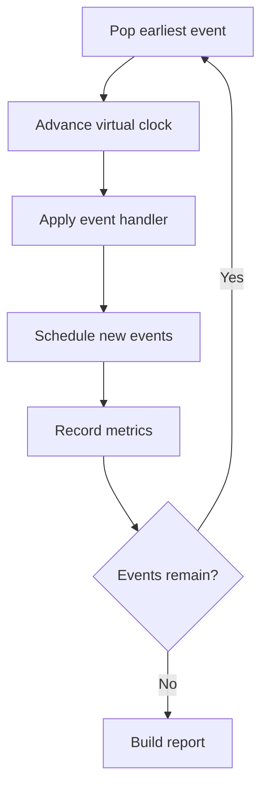

# QueueLens.jl

A small discrete-event simulator for exploring queueing, backpressure, worker
concurrency, connection pools, retries, and overload in asynchronous services.

> **Status: pre-0.1, under active development.** The engine is being built from
> scratch as a learning project. Nothing here is production-ready yet.

## Problem statement

You describe an async service — arrival bursts, a worker pool, per-worker
concurrency, a database connection pool, timeouts and a retry policy — and
QueueLens simulates it in virtual time and reports throughput, latency
percentiles, utilization, queue growth, retry amplification, and the likely
bottleneck.

Example of the kind of system it targets:

- 1,000 jobs arrive in bursts
- 8 workers consume jobs
- each worker allows 25 concurrent async tasks
- the database pool has 100 connections
- jobs perform HTTP and database I/O
- failed jobs retry with backoff

## Questions it aims to answer

- What happens when arrival rate exceeds service capacity?
- Does more concurrency improve throughput, or just add waiting on the database?
- How large does the queue grow during a burst?
- How much extra load do retries create?
- Which resource saturates first?
- How do fixed, exponential and jittered backoff compare?
- What is the tradeoff between bounded queues, rejection, and latency?
- How sensitive are results to service-time variance?

## The event loop



The simulation advances a **virtual clock**. It never sleeps in real time to
model service duration.

## Getting started

Requires Julia 1.10 or newer (developed on 1.12).

```console
$ git clone <repo-url> QueueLens
$ cd QueueLens
$ julia --project=.
julia> ]            # enter Pkg mode
(QueueLens) pkg> instantiate
(QueueLens) pkg> test
```

To load the package in a REPL session:

```julia
julia> using QueueLens
```

## Correctness requirements

These are invariants the engine must uphold, and what the test suite exists to
protect:

- Virtual time is monotonic.
- Event ordering is deterministic for equal timestamps.
- Every logical job has exactly one terminal outcome.
- Resource usage never exceeds capacity and never goes negative.
- Timed-out attempts cannot later mutate completed state.
- Queue statistics are time-weighted where appropriate.
- Randomness comes from an explicit RNG, never hidden global state.
- Warm-up behavior and discarded samples are documented.
- Configuration, package version and seed accompany every report.

## Roadmap

| Milestone | Scope | Status |
|---|---|---|
| 0 | Julia foundations: package skeleton, deterministic hand-calculated simulation, event-ordering tests | done |
| 1 | Minimal discrete-event engine: event calendar, FIFO queue, single worker, job results | done |
| 2 | Probabilistic workloads: arrival/service distributions, seeds, percentiles, confidence intervals | done |
| 3 | Worker capacity, shared resource pools and backpressure: DB pool, bounded FIFO admission with rejection, utilization | done |
| 4 | Failure, timeout and retry: injection, timeout events, backoff policies, retry amplification | in progress (failure and timeout complete) |
| 5 | CLI, TOML configuration, CSV/JSON summaries and plots | planned |
| 6 | Parameter sweeps and evidence-based bottleneck recommendations | planned |

Current implementation: configurable parallel worker slots with FIFO waiting,
probabilistic workloads, per-run percentiles and confidence intervals across
repeated seeds. Named resource pools, sequential stages and bounded worker
queues with rejection reports are implemented. Full-run time-weighted queue
means and worker/resource utilization are available in single and repeated runs.
Milestone 3 is complete, including the verified capacity-comparison experiment.
Its admission policy is bounded FIFO waiting with rejection when full;
additional admission policies are future extensions. Next is failure, timeout and retry.
See [PROGRESS.md](PROGRESS.md) for decisions and the next learning exercise.

### Worker capacity

```julia
jobs = [Job(1, 0.0, 3.0), Job(2, 1.0, 3.0), Job(3, 2.0, 3.0)]
result = simulate(jobs, Dict{Symbol,Int}(), 2)
[r.waiting_time for r in result.completed]  # [0.0, 0.0, 1.0]
```

Both `simulate(jobs, resources, capacity)` and
`simulate(scenario, resources, capacity)` require resource configuration as the
second argument. Use `Dict{Symbol,Int}()` explicitly for no shared resources.
Worker capacity is the third argument and defaults to one.
`simulate_repeated(scenario, resources, num_runs, capacity)` uses the same
configuration for each run, with fresh pools, waiting queues and RNG state.
Both simulation overloads return `SimulationResult`, with `completed` and
`rejected` and `failed` vectors and a `monitoring` snapshot. `summarize(result)` summarises
only the completed jobs; rejected jobs have no service latency.

### Shared resources

```julia
jobs = [
    Job(1, 0.0, [QueueLens.ServiceStep(:db, 2.0)]),
    Job(2, 0.0, [QueueLens.ServiceStep(:db, 1.0)]),
]
result = simulate(jobs, Dict(:db => 1), 2)
[r.completion_time for r in result.completed]  # [2.0, 3.0]
```

A stage acquires its named resource before its duration starts and releases it
at stage completion. Resource waiting is FIFO; the worker remains occupied
until the whole job finishes. `waiting_time` measures only the initial wait
for a worker, while `latency` includes resource waits. Input capacities are
never mutated. Scenario-generated jobs currently have one resource-free stage;
use explicit jobs for stages that require shared resources.

### Bounded worker queues

```julia
jobs = [Job(i, t, 3.0) for (i, t) in enumerate((0.0, 0.5, 1.0, 3.5))]
result = simulate(jobs, Dict{Symbol,Int}(); queue_capacity = 1)
[r.id for r in result.completed]  # [1, 2, 4]
[r.id for r in result.rejected]   # [3]
result.rejected[1].reason        # :queue_full
rejection_rate(result)           # 0.25
```

`queue_capacity` limits only jobs waiting for a worker. Zero means no worker
waiting; the default `typemax(Int)` is effectively unbounded. A busy system
rejects new arrivals when its worker queue is full, and continues generating
later arrivals. Resource waiting queues are not bounded by this option.
Events sharing a timestamp still follow calendar insertion order; a worker is
not free until its whole-job completion event has been handled.

`simulate_repeated(...; queue_capacity = 1)` uses the same limit in every run
and reports `num_rejected` and `rejection_rate` as means and confidence-interval
half-widths across seeds. Both cover the full run. The rate is a fraction in
[0, 1], not a percentage or jobs per unit time; an empty report yields `0.0`.
Warm-up still discards only an initial fraction of completed jobs for the
latency and throughput estimates.

### Time-weighted monitoring

```julia
jobs = [
    Job(1, 0.0, [QueueLens.ServiceStep(:db, 3.0)]),
    Job(2, 0.0, [QueueLens.ServiceStep(:db, 3.0),
                 QueueLens.ServiceStep(nothing, 2.0)]),
]
result = simulate(jobs, Dict(:db => 1, :cache => 2), 2)
m = result.monitoring
m.duration                       # 8.0
m.mean_queue_length              # 0.0 (waiting for a worker)
m.worker_utilization             # 0.6875 = 11 / (2 * 8)
m.resources[:db].mean_queue_length # 0.375 = 3 / 8
m.resources[:db].utilization      # 0.75 = 6 / (1 * 8)
m.resources[:cache].utilization   # 0.0 (configured but unused)
```

Each mean is the integral of its count divided by the observation duration.
Utilization additionally divides by capacity and is a fraction, not a percentage.
The window is **time zero through the last event**, including initial idle time
and the final draining interval. A run ending at time zero reports zero means
and utilization. Workers stay occupied while waiting for a resource.

`MonitoringSummary` stores scalar values and a fresh dictionary of
`ResourceSummary` values, never the live accumulators. Simulation always supplies
it. An outcome-only `SimulationResult(completed, rejected)` has `monitoring = nothing`:
resource histories cannot be recovered from completed-job timings alone.

Monitoring is full-run even when `summarize` discards completed jobs as warm-up.
It does **not** use the throughput window, which starts at the first retained
job's arrival. `simulate_repeated` reports `mean_queue_length`,
`worker_utilization`, `resource_mean_queue_length[name]` and
`resource_utilization[name]` as `Estimate`s. These average per-run values with
equal weight across seeds; neither time histories nor durations are pooled.
Scenario-generated jobs currently use no shared resources, so their configured
resource metrics are zero. Resource contention experiments use explicit jobs.

### Capacity comparison experiment

Run `julia --project=. experiments/capacity_tradeoff.jl` to compare four jobs
arriving at zero, each requiring one three-second DB step. The experiment prints
completion times, both queue means and both utilization fractions. It uses
unbounded worker queues, no randomness and no warm-up discard.

| Case | Workers | DB slots | End time (s) | Mean worker queue | Mean DB queue | Worker utilization | DB utilization |
|---|---|---|---|---|---|---|---|
| A | 2 | 1 | 12 | 0.75 | 0.75 | 0.875 | 1.0 |
| B | 4 | 1 | 12 | 0.0 | 1.5 | 0.625 | 1.0 |
| C | 2 | 2 | 6 | 1.0 | 0.0 | 1.0 | 1.0 |

Doubling workers in A moves waiting to the DB queue without shortening the run.
Doubling DB capacity instead halves the end time. Queue means use each run's
own duration; C has less total worker waiting than A (6 versus 9 job-seconds),
even though its mean worker queue is larger (1.0 versus 0.75).

### Milestone 4 exercise status

Active-stage failure handling and stale-completion detection are implemented
and tested. Explicit-job runs accept experimental `failures` events. A failure
releases the job's worker and held resource; its old completion events are
ignored without extending the simulation clock.
Normal runs without failures retain their existing behavior. Outcome storage
in `result.failed`, resource ownership tracking and dispatch connections are ready.

The [failure contracts](test/failures/failure_contract_tests.jl) cover the reference
scenario and ownership rules. These behavioral tests are included in the
standard suite and also run separately with
`julia --project=. test/failures/failure_contract_tests.jl`.
The rejection-rate denominator includes successes, rejections and failures.
Probability-based failure and retry behavior are not implemented.

Timeout is available as `Job(...; timeout=2.0)`: a whole-job
deadline from worker start, including resource waits but excluding worker-queue
waiting. Whole-job completion exactly at the deadline wins. A timed-out job
releases its worker and any held resource, or leaves its resource waiting queue.
See [the completed timeout exercise](docs/timeout_exercise.md) for the contracts.
Its 91 behavioral checks are included in the default suite and also run with
`julia --project=. test/timeouts/timeout_contract_tests.jl`. Timeouts use `result.failed`
with `reason = :timeout`, not a separate outcome list.

## Non-goals for v0.1

Real task execution, a production job queue, distributed simulation, Kubernetes
deployment, a web dashboard, packet-level network simulation, reinforcement
learning, and deep-learning dependencies.

## Planned configuration format

Scenarios will be plain TOML (arriving in Milestone 5 — fields land
incrementally with the milestones that need them):

```toml
seed = 42
duration_seconds = 300.0

[arrival]
kind = "poisson"
rate_per_second = 80.0

[service]
kind = "lognormal"
mean_ms = 120.0
sigma = 0.6

[workers]
count = 8
async_tasks_per_worker = 25

[database]
pool_size = 100
hold_mean_ms = 40.0

[queue]
capacity = 5000
overflow = "reject"

[retry]
max_attempts = 3
strategy = "exponential_jitter"
base_delay_ms = 100.0
```

## Repository layout

```text
QueueLens/
├── Project.toml
├── Manifest.toml
├── README.md
├── PROGRESS.md
├── src/
│   ├── QueueLens.jl           # module entry point, exports and load order
│   ├── models/
│   │   ├── distributions.jl  # duration distributions and sampling
│   │   ├── scenario.jl       # generated-workload configuration
│   │   ├── jobs.jl           # input jobs and sequential service steps
│   │   └── events.jl         # event definitions
│   ├── simulation/
│   │   ├── state.jl          # JobRecord, CalendarEntry and SimState
│   │   ├── resources.jl      # resource-pool primitive
│   │   ├── monitoring.jl     # time-weighted accumulators
│   │   ├── calendar.jl       # event insertion and extraction
│   │   ├── outcomes.jl       # validated outcome bookkeeping
│   │   ├── scheduling.jl     # admission, starts and resource handoff
│   │   ├── handlers.jl       # event dispatch and stale-event detection
│   │   └── engine.jl         # simulate entry points and shared run! loop
│   └── reporting/
│       ├── results.jl        # outcome and summary containers
│       ├── metrics.jl        # single-run statistics
│       ├── repeated.jl       # confidence intervals and repeated runs
│       └── display.jl        # text rendering
├── test/
│   ├── runtests.jl           # complete suite
│   ├── models/              # input and job construction
│   ├── simulation/          # calendar, stages, workers and scenarios
│   ├── resources/           # resource pools, admission and API integration
│   ├── failures/            # failure validation, ownership and contracts
│   ├── timeouts/            # deadlines, waiting cancellation and contracts
│   ├── reporting/           # observations, summaries and capacity comparison
│   └── support/
│       └── fixtures.jl      # shared test setup
├── experiments/
│   ├── capacity_tradeoff.jl
│   ├── distribution_shapes.jl
│   └── variance_effect.jl
└── docs/
    ├── architecture.md
    └── timeout_exercise.md
```

See [the architecture guide](docs/architecture.md) for responsibility boundaries
and load order. Old flat implementation/test files have been removed; there are
no duplicate forwarding files. The public API and `test/runtests.jl` entry point
are unchanged. Later milestones may add policies, scenarios and benchmarks.

## A note on interpretation

A simulation result is not a production guarantee. Every reported number is
conditional on the model, its assumptions, and the seed used to produce it.

## License

Not yet chosen.
