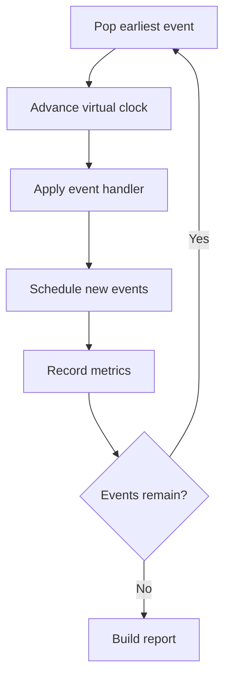

# QueueLens.jl

A small discrete-event simulator for exploring queueing, backpressure, worker
concurrency, connection pools, retries, and overload in asynchronous services.

> **Status: pre-0.1, under active development.** The engine is being built from
> scratch as a learning project. Nothing here is production-ready yet.

## Problem statement

You describe an async service — arrival bursts, a worker pool, per-worker
concurrency, a database connection pool, timeouts and a retry policy — and
QueueLens simulates it in virtual time and reports throughput, latency
percentiles, utilization, queue growth, retry amplification, and the likely
bottleneck.

Example of the kind of system it targets:

- 1,000 jobs arrive in bursts
- 8 workers consume jobs
- each worker allows 25 concurrent async tasks
- the database pool has 100 connections
- jobs perform HTTP and database I/O
- failed jobs retry with backoff

## Questions it aims to answer

- What happens when arrival rate exceeds service capacity?
- Does more concurrency improve throughput, or just add waiting on the database?
- How large does the queue grow during a burst?
- How much extra load do retries create?
- Which resource saturates first?
- How do fixed, exponential and jittered backoff compare?
- What is the tradeoff between bounded queues, rejection, and latency?
- How sensitive are results to service-time variance?

## The event loop



The simulation advances a **virtual clock**. It never sleeps in real time to
model service duration.

## Getting started

Requires Julia 1.10 or newer (developed on 1.12).

```console
$ git clone <repo-url> QueueLens
$ cd QueueLens
$ julia --project=.
julia> ]            # enter Pkg mode
(QueueLens) pkg> instantiate
(QueueLens) pkg> test
```

To load the package in a REPL session:

```julia
julia> using QueueLens
```

## Correctness requirements

These are invariants the engine must uphold, and what the test suite exists to
protect:

- Virtual time is monotonic.
- Event ordering is deterministic for equal timestamps.
- Every logical job has exactly one terminal outcome.
- Resource usage never exceeds capacity and never goes negative.
- Timed-out attempts cannot later mutate completed state.
- Queue statistics are time-weighted where appropriate.
- Randomness comes from an explicit RNG, never hidden global state.
- Warm-up behavior and discarded samples are documented.
- Configuration, package version and seed accompany every report.

## Roadmap

| Milestone | Scope | Status |
|---|---|---|
| 0 | Julia foundations: package skeleton, deterministic hand-calculated simulation, event-ordering tests | done |
| 1 | Minimal discrete-event engine: event calendar, FIFO queue, single worker, job results | done |
| 2 | Probabilistic workloads: arrival/service distributions, seeds, percentiles, confidence intervals | done |
| 3 | Worker capacity, shared resource pools and backpressure: DB pool, bounded queues, admission policies, utilization | in progress |
| 4 | Failure, timeout and retry: injection, timeout events, backoff policies, retry amplification | planned |
| 5 | CLI, TOML configuration, CSV/JSON summaries and plots | planned |
| 6 | Parameter sweeps and evidence-based bottleneck recommendations | planned |

Current implementation: configurable parallel worker slots with FIFO waiting,
probabilistic workloads, per-run percentiles and confidence intervals across
repeated seeds. Milestone 3 has started; shared DB pools and backpressure remain.
See [PROGRESS.md](PROGRESS.md) for decisions and the next learning exercise.

### Worker capacity

```julia
jobs = [Job(1, 0.0, 3.0), Job(2, 1.0, 3.0), Job(3, 2.0, 3.0)]
results = simulate(jobs, 2)
[r.waiting_time for r in results]  # [0.0, 0.0, 1.0]
```

Both `simulate(jobs, capacity)` and `simulate(scenario, capacity)` accept a
positive integer capacity as the second positional argument, defaulting to one.
Each slot serves one job at a time. `simulate_repeated` currently uses one slot
and does not yet accept a capacity argument.

## Non-goals for v0.1

Real task execution, a production job queue, distributed simulation, Kubernetes
deployment, a web dashboard, packet-level network simulation, reinforcement
learning, and deep-learning dependencies.

## Planned configuration format

Scenarios will be plain TOML (arriving in Milestone 5 — fields land
incrementally with the milestones that need them):

```toml
seed = 42
duration_seconds = 300.0

[arrival]
kind = "poisson"
rate_per_second = 80.0

[service]
kind = "lognormal"
mean_ms = 120.0
sigma = 0.6

[workers]
count = 8
async_tasks_per_worker = 25

[database]
pool_size = 100
hold_mean_ms = 40.0

[queue]
capacity = 5000
overflow = "reject"

[retry]
max_attempts = 3
strategy = "exponential_jitter"
base_delay_ms = 100.0
```

## Repository layout

```text
QueueLens/
├── Project.toml
├── PROGRESS.md
├── src/
│   ├── QueueLens.jl      # module, exports, includes — no logic
│   ├── distributions.jl  # Constant, Exponential, LogNormal, sample
│   ├── scenario.jl       # Scenario
│   ├── jobs.jl           # Job, JobRecord, JobResult
│   ├── events.jl         # SimEvent and its subtypes
│   ├── state.jl          # SimState, the event calendar
│   ├── metrics.jl        # summaries, percentiles, repeated-run estimates
│   └── engine.jl         # handlers and the main loop
├── test/
│   ├── runtests.jl
│   ├── distribution_tests.jl
│   ├── calendar_tests.jl
│   ├── engine_tests.jl
│   ├── worker_tests.jl
│   ├── scenario_tests.jl
│   ├── metric_tests.jl
│   └── repeated_tests.jl
├── experiments/
│   ├── distribution_shapes.jl
│   └── variance_effect.jl
└── README.md
```

Files are split only when responsibilities become real. Later milestones add
`resources.jl` and `policies.jl` under `src/`, plus `scenarios/`, `docs/` and
`benchmarks/`.

## A note on interpretation

A simulation result is not a production guarantee. Every reported number is
conditional on the model, its assumptions, and the seed used to produce it.

## License

Not yet chosen.
